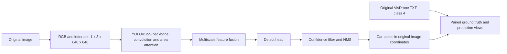

# First YOLOv12-S preview

## Decisions made together

| Choice | Value |
| --- | --- |
| Detector | Author's default YOLOv12-Turbo S, COCO pretrained |
| Input | One RGB image: `[1, 3, 640, 640]`, proportional resize plus padding |
| Output class | COCO car ID 2, compared with original VisDrone car ID 4 |
| Sample | 30 validation images from distinct filename-prefix groups |
| Confidence | 0.25 |
| NMS IoU | 0.70 |
| Display | Ground truth on the left, predictions and scores on the right |
| Execution | MyGPU RTX 5090 only; Mac edits and tests lightweight code |

The implementation preserves the pretrained architecture. There is no additional ResNet, Dropout, fine-tuning, optimizer or training loop in this experiment. The source is pinned to the revision in `configs/yolov12s_car_preview.json`.

## Code map

- `model_arch.py`: loads the original detector and defines the explicit prediction arguments.
- `data_utils.py`: reads original TXT annotations and prepares a reproducible sample manifest.
- `run_inference.py`: verifies inputs, runs CUDA inference and writes paired images, predictions, counts and provenance.
- `scripts/setup_mygpu.sh`: installs the author package into an isolated remote environment and downloads the official weight. It refuses to run on Mac.



## Mac: prepare and inspect without ML frameworks

```bash
python3 data_utils.py
python3 run_inference.py
python3 -m unittest discover -s tests -p 'test_*.py'
```

For the pinned lightweight linter, install `requirements-dev.txt` into the Mac
development environment and run `ruff check model_arch.py data_utils.py
run_inference.py tests/test_preview.py`. This installs no model framework.

The second command is a dry run: it verifies the selected files and prints arguments without importing Torch or Ultralytics. Once the sample manifest is committed, use the same manifest on both machines.

## MyGPU: execute the committed revision

Clone the public repository to `~/drone-case`, or fast-forward an existing clean clone. Keep it separate from the other research repositories. The first remote checkout may be sparse: code plus the committed 30-image sample, so it does not need to fetch the entire 1.9 GB dataset. A dry run verifies every selected image/annotation hash before model setup.

```bash
cd ~/drone-case
bash scripts/setup_mygpu.sh
.venv-runtime/bin/python run_inference.py --execute
```

The setup uses the existing CUDA-compatible `torchenv` packages through a separate virtual environment; it does not modify `torchenv`. The upstream legacy requirements are not installed because they pin an older Torch/CUDA combination. The author's implementation has an explicit attention fallback when FlashAttention is absent; the backend actually used is recorded. Weight loading supports the author's trusted legacy checkpoint only, with source receipt and checksum checking before loading.

The official release reports a checkpoint size of 18,708,559 bytes but provides
no SHA-256 digest. Size is checked; the first official HTTPS download records its
observed hash, and subsequent loads check consistency with that receipt. The
receipt is not an independent authenticity proof. No weight has been downloaded
in this code-only delivery.

## What to inspect

Each image is an opportunity to ask: which cars were missed, which predicted cars are not cars, and which boxes are badly placed? Gray boxes on the ground-truth panel mark ignored regions. Counts alone cannot establish precision or recall.

The ground-truth panel shows scored category-4 cars and, in gray, category-0 or
score-0 ignored regions. Other categories, including scored category-11
(`others`) boxes, are intentionally not drawn in this car-only view. The code
does not automatically label predictions as true or false positives.

Filename-prefix groups provide dispersion, not proof of independent scenes. This is a qualitative preview of 30 images, not a formal VisDrone benchmark. Results, weights and local environments are ignored by Git.

Sources: [YOLOv12 author implementation](https://github.com/sunsmarterjie/yolov12), [VisDrone](https://github.com/VisDrone/VisDrone-Dataset).

## Current delivery boundary

The requested delivery stops after code synchronization to MyGPU. Runtime setup and the `--execute` command are documented next steps for Bruce to review and run together later; they have not been executed as part of this slice.
